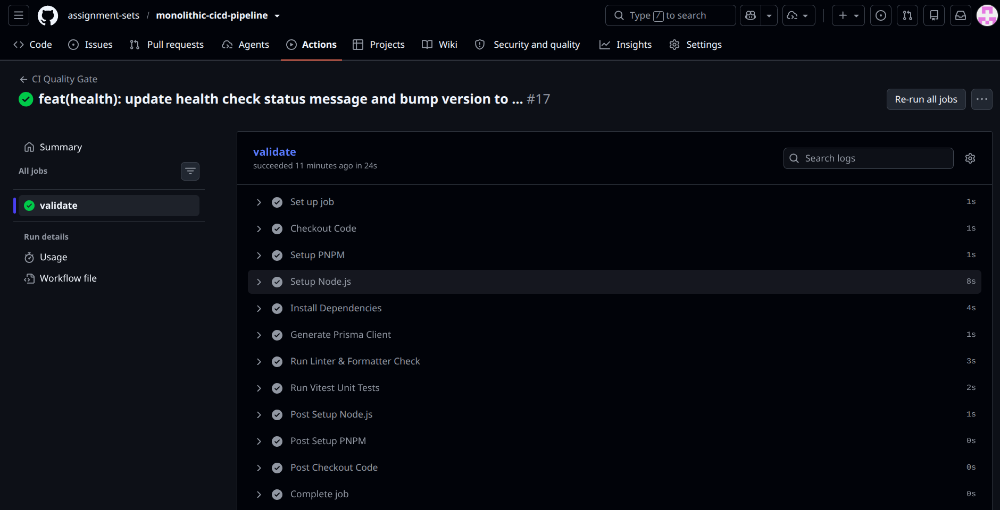
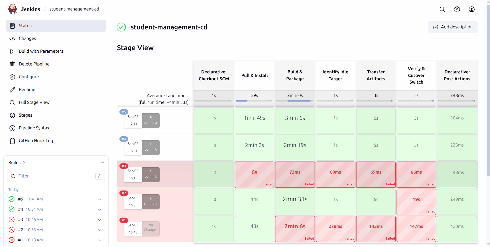
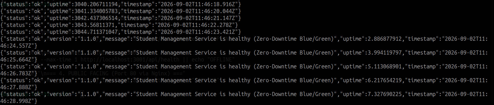
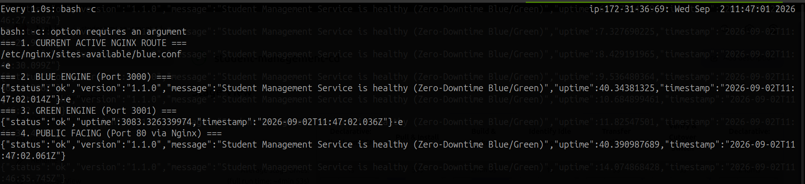
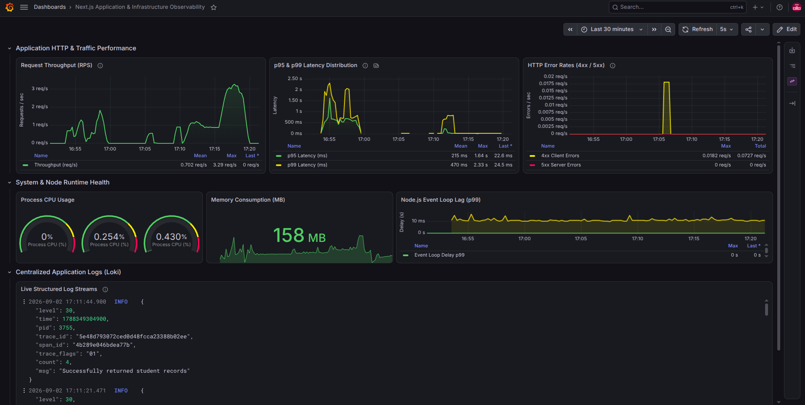
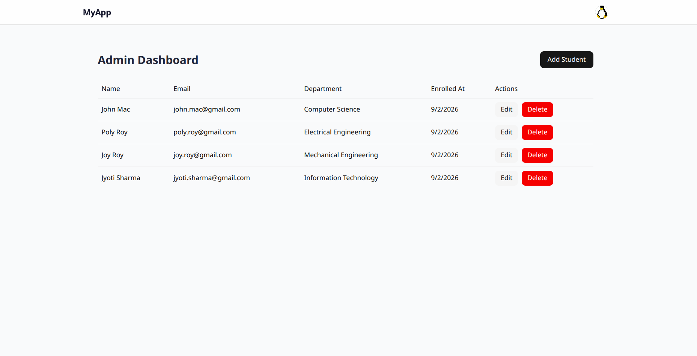
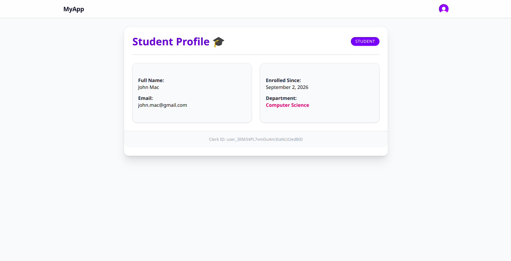

# Monolithic CI/CD Pipeline

A CI/CD pipeline and blue-green deployment project on AWS using a Next.js student management application as the deployment workload. The setup includes GitHub Actions for CI quality checks, Jenkins for CD orchestration, Terraform for AWS infrastructure provisioning, and an observability stack using OpenTelemetry, Prometheus, Loki, and Grafana.

---

## Architecture & Workflow

The pipeline runs across three EC2 instances:

```text
 Pull Request / Push to main
              │
              ▼
   ┌─────────────────────┐
   │ GitHub Actions (CI) │  Install Dependencies ➔ Generate Prisma Client ➔ Lint ➔ Unit Tests (~24s)
   └──────────┬──────────┘
              │ Merge / Webhook
              ▼
   ┌─────────────────────┐
   │    Jenkins (CD)     │  Build Next.js ➔ Package Tar ➔ SCP Payload ➔ Health Probe (~4m 50s)
   └──────────┬──────────┘
              │ SSH Deployment Execution
              ▼
   ┌───────────────────────────────┐
   │  App Server (Blue ⇄ Green)    │  Deploy to Idle Target (3000 / 3001) ➔ Verify /api/health
   │  Nginx Reverse Proxy          │  Cutover: Update Symlink ➔ Reload Nginx
   └──────────┬────────────────────┘
              │ Metrics & Logs Ingestion
              ▼
   ┌─────────────────────────────────┐
   │        Monitoring Server        │  OTel Collector (4317) ➔ Prometheus & Loki ➔ Grafana (3000)
   └─────────────────────────────────┘
```

---

## Features

- **CI Quality Checks:** Runs dependency installation, Prisma client generation, ESLint 9 checks, and Vitest unit tests on GitHub Actions.
- **CD Deployment:** Jenkins receives GitHub push webhooks, builds Next.js in standalone mode, packages the output into a `.tar.gz` archive, and deploys it over SSH.
- **Blue-Green Deployment:** Routes traffic through Nginx between two systemd services (`student-blue` on port 3000 and `student-green` on port 3001). Health checks are verified on `/api/health` before updating the Nginx symlink.
- **Infrastructure as Code:** Provisions three AWS EC2 instances, security groups, and key pairs using Terraform.
- **Observability:** Collects application metrics and logs using OpenTelemetry Collector, Prometheus, Loki, and Grafana.

---

## Pipeline Execution & Quality Gates

| GitHub Actions CI Quality Gate (~24s) | Jenkins CD Blue-Green Pipeline (~4m 53s) |
| :---: | :---: |
|  |  |

### Pipeline Speed & Deployment Duration

- **Total Execution Time:** ~5 to 5.5 minutes from Git push to deployment cutover.
- **Stage Breakdown (Measured):**
  - **GitHub Actions CI:** ~24 seconds
    - Setup and dependencies: 12s
    - Prisma client generation: 1s
    - ESLint checks: 3s
    - Vitest unit tests: 2s
  - **Jenkins CD:** ~4.5 to 5 minutes
    - SCM checkout: 1s
    - Dependency installation (`npm install`): ~1m 50s
    - Standalone Next.js build & `.tar.gz` packaging: ~2m 30s
    - Target environment detection (Blue vs Green): 1s
    - SSH transfer and archive extraction: ~5s
    - Service restart, `/api/health` verification, and Nginx reload: ~3s

### Quality Checks

- **Prisma Schema Generation:** `pnpm prisma generate`
- **Linting:** `pnpm run lint` (ESLint 9)
- **Unit Tests:** `pnpm run test:run` (Vitest suites for auth middleware, helper functions, and components)

---

## Blue-Green Deployment Verification

| Continuous Request Polling (0 Dropped Requests) | Server-Side Routing & Standby Watcher |
| :---: | :---: |
|  |  |

- **Routing:** Nginx points to either `student-blue.service` (port 3000) or `student-green.service` (port 3001).
- **Health Verification:** Jenkins polls `/api/health` on the target port before switching traffic.
- **Cutover:** The symlink at `/etc/nginx/sites-enabled/student-app` is updated to point to the new site config, followed by `systemctl reload nginx`.
- **Standby Environment:** The previous environment remains running in the background for fallback and connection draining.

---

## Observability & Monitoring



### Metrics & Logs Collected

- **Metrics (Prometheus & OpenTelemetry Collector):**
  - Request rate (requests per second)
  - Latency ($p95$ and $p99$ response times)
  - HTTP 4xx and 5xx error rates
  - Process CPU and memory usage
  - Node.js event loop delay
- **Logs (Loki & Pino):**
  - Application logs sent via `pino-loki`
  - Logs include timestamp, log level, HTTP status, and trace/span IDs
- **Dashboards (Grafana):**
  - Pre-configured dashboard displaying application metrics, system resource usage, and log streams.

---

## Application UI

| Admin Dashboard | Student Profile |
| :---: | :---: |
|  |  |

---

## Infrastructure Overview

The infrastructure consists of three AWS EC2 instances provisioned in the `ap-south-1` region using Terraform:

| Server | Instance Type | Ports Exposed | Purpose |
| :--- | :--- | :--- | :--- |
| **Jenkins** | `t3a.medium` | `8080` (UI), `22` (SSH) | Runs Jenkins and executes the CD pipeline. |
| **App Server** | `t3a.small` | `80` (HTTP), `22` (SSH) | Runs the Next.js app on ports 3000 (Blue) and 3001 (Green) behind Nginx. |
| **Monitoring** | `t3a.small` | `3000` (Grafana), `9090` (Prometheus), `3100` (Loki), `4317` (OTel) | Runs Prometheus, Loki, Grafana, and OpenTelemetry Collector in Docker. |

> Manual server preparation commands, Systemd service files, and Nginx configurations are documented in [SERVER_SETUP_RUNBOOK.md](./SERVER_SETUP_RUNBOOK.md).

---

## Repository Structure

```text
.
├── .github/          # GitHub Actions workflow configurations (CI)
├── devops/           # Jenkinsfile and Nginx configurations
│   ├── jenkins/      # Declarative Jenkinsfile
│   └── nginx/        # Reverse proxy site configurations (blue.conf / green.conf)
├── infra/            # Terraform manifests for AWS EC2 instances and networking
│   └── terraform/    
├── monitoring/       # Docker Compose setup for Prometheus, Grafana, Loki, and OTel
│   ├── grafana/      # Dashboard and datasource provisioning files
│   ├── loki/         # Loki configuration
│   ├── otel-collector/ # OpenTelemetry Collector configuration
│   └── prometheus/   # Prometheus scrape configuration
├── static/           # Screenshots and diagrams
└── src/              # Next.js application source code (App Router, Prisma, Clerk, Pino)
```

---

## Tech Stack

- **CI/CD:** GitHub Actions, Jenkins
- **Infrastructure as Code:** Terraform, AWS (EC2, VPC, Security Groups)
- **Web Server & Process Manager:** Nginx, Systemd
- **Deployment Strategy:** Blue-Green deployment
- **Observability:** OpenTelemetry Collector, Prometheus, Grafana, Loki, Pino
- **Application Stack:** Next.js 14, React, Prisma ORM, PostgreSQL (Aiven Cloud), Clerk
